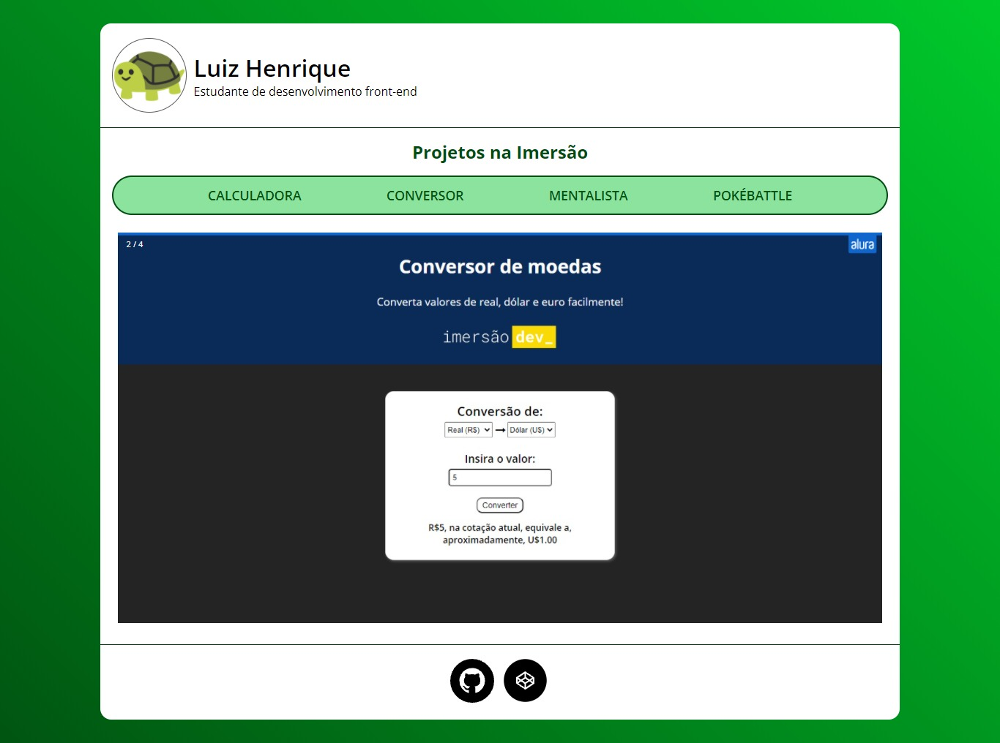

# Certificard - Imersão Dev

Um "certificado" contendo todos os meus projetos na Imersão Dev.

## Conteúdos

- [Overview](#overview)
  - [O projeto](#o-projeto)
  - [Screenshot](#screenshot)
  - [Links](#links)
- [Processo](#processo)
  - [Feito com](#feito-com)

- [Autor](#autor)

## Overview

### O projeto

- Com HTML e CSS, fazer uma página contendo um "cartão", como um certificado, juntando todos os projetos feitos durante a Imersão.

### Screenshot

### Links

- [URL do Site](https://luizhf42.github.io/certificard)

## Processo

### Feito com

- HTML5
- CSS3
- Flexbox
- JavaScript

## Autor

- Propriamente eu, Luiz Henrique.
